# MAL Tracker

### Information

&nbsp;&nbsp;&nbsp;&nbsp;&nbsp;&nbsp;&nbsp;&nbsp;This project takes the data shown when viewing your profile on [MyAnimeList](https://MyAnimeList.net/), and parses it into a list of entries. The data is then used to create multiple different visualizations. It takes the form of a site that has you input a text file of an entire MyAnimeList profile page, found at "myanimelist.net/animelist/\<username>"

### Features

- List of entries, can be sorted and partially filtered 

Image
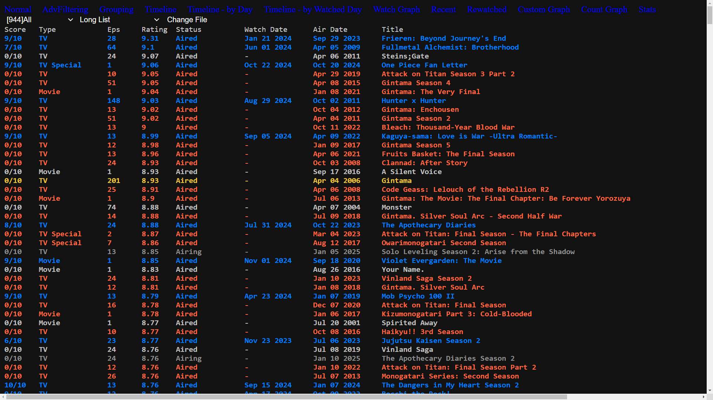

- List of entries with advanced filtering, sorting, and display options 

Image
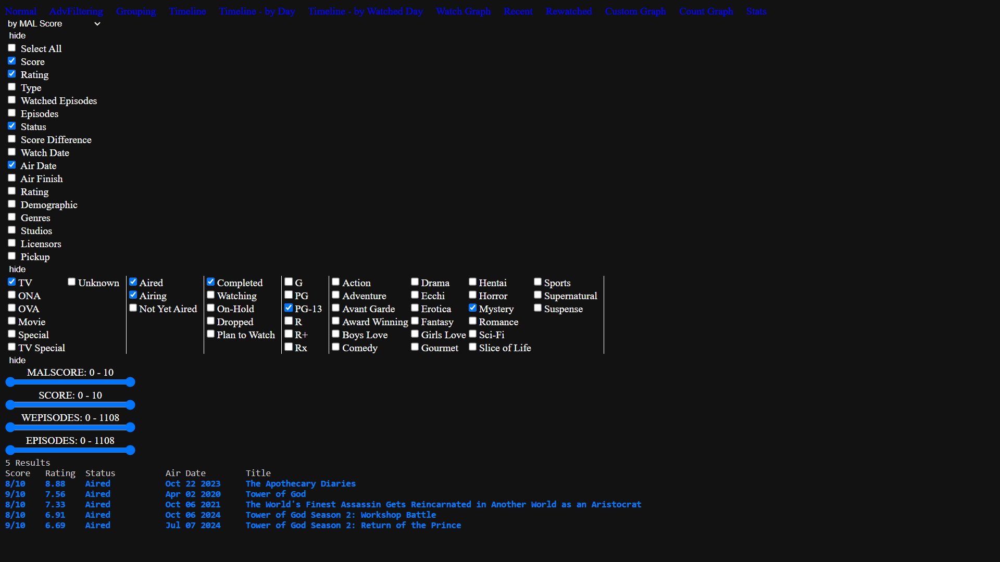

- List of series, can be sorted by group attributes 

Image
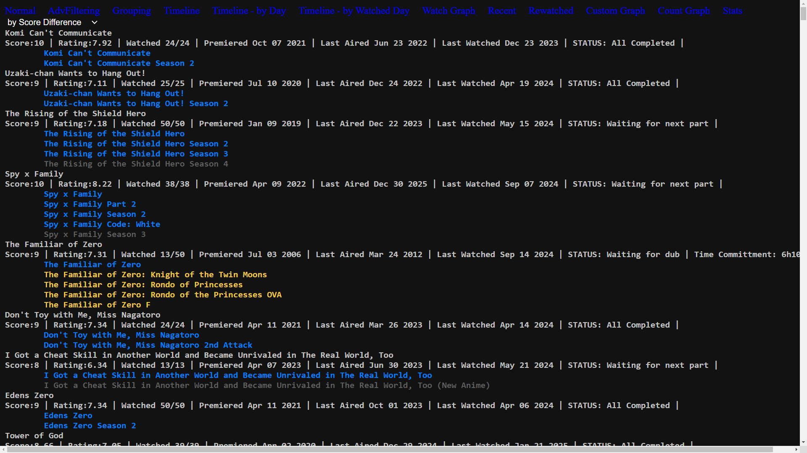

- Timeline of entries grouped by month 

Image
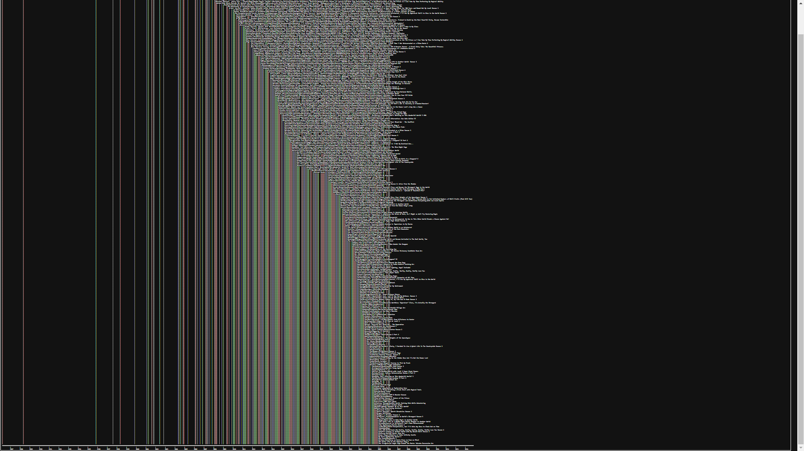

- Timeline of entries, plotted by day only 

Image
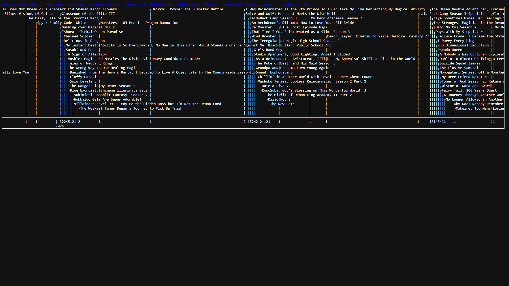

- Timeline of entries by day, plotted by watch date instead of air date 

Image
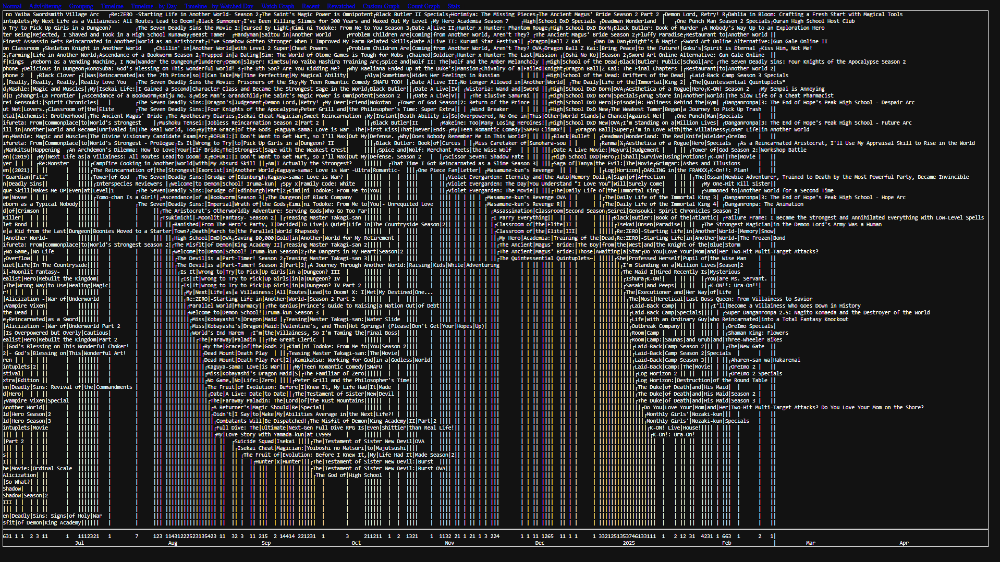

- Graph showing how many entries were watched on each day 

Image
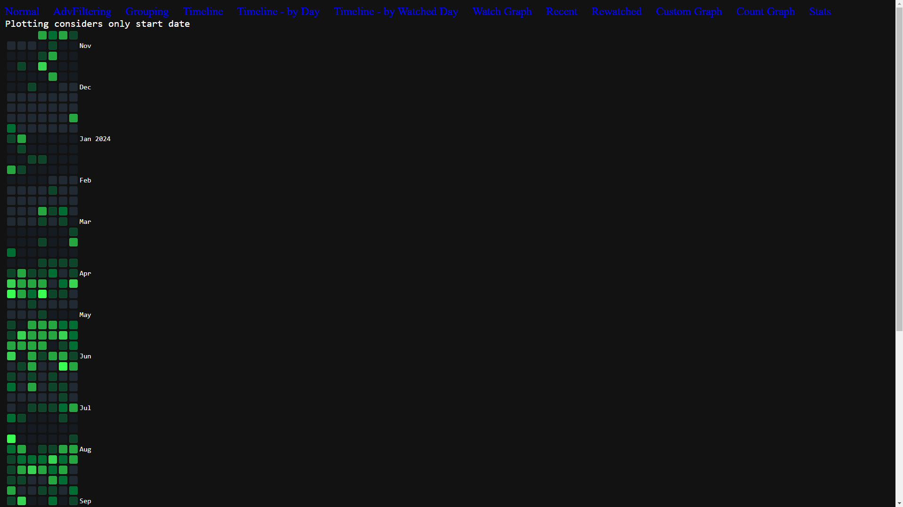

- Page showing recent updates, suggesting next watches, and shows a variety of colored graphs 

Image
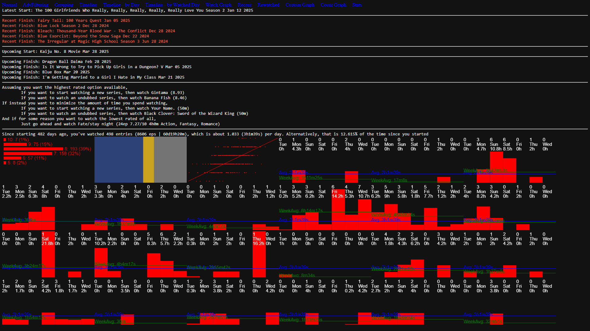

- List of entries organized by rewatch status, click on an entry to mark as rewatched, pushing it to the bottom of the list 

Image
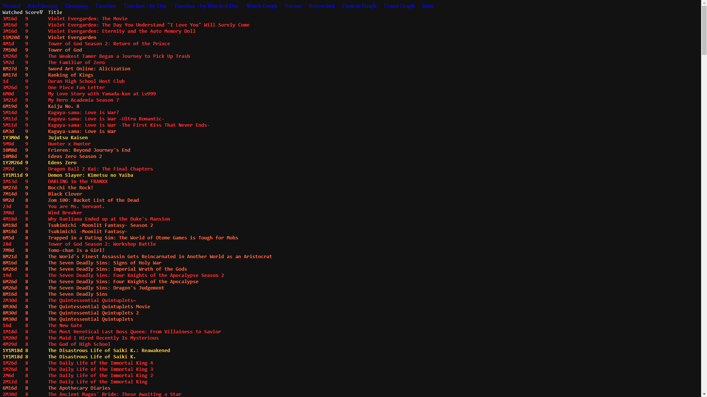

- Custom graph, allowing you to choose x and y axis values 

Image
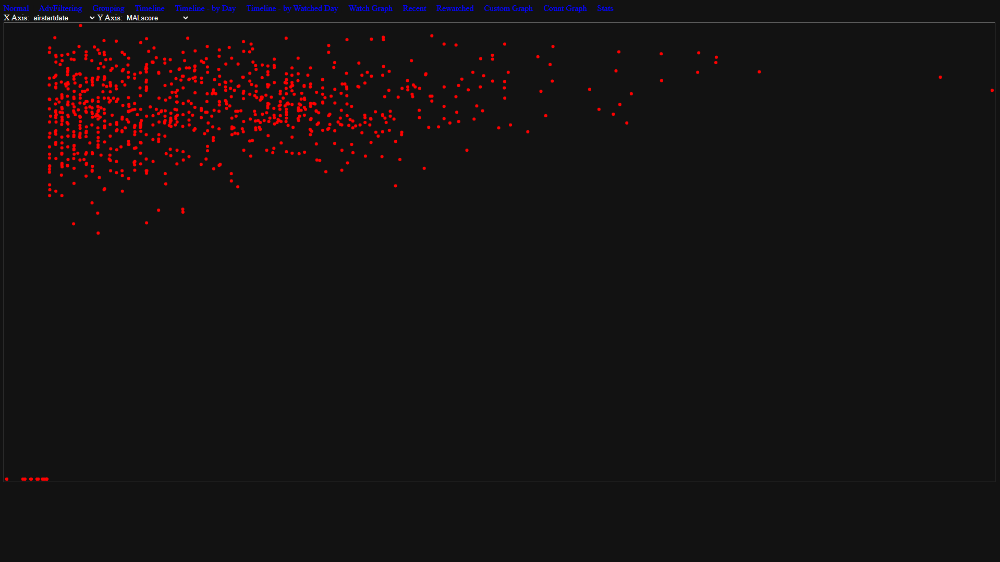

- Count graph, allowing you to choose x axis and plots the number of entries that match each category 

Image
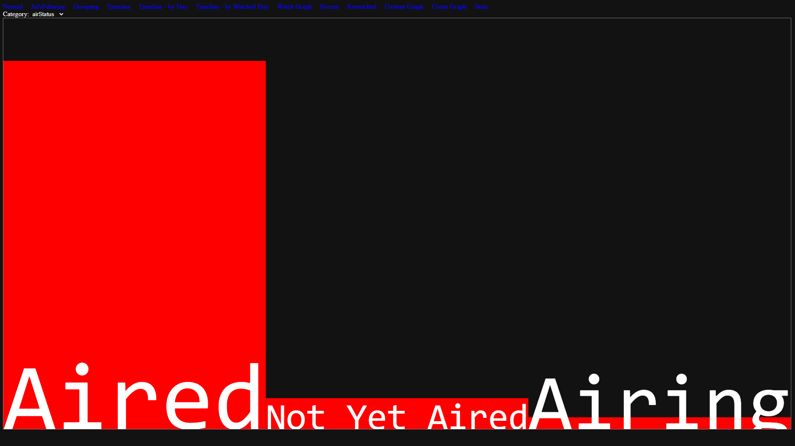

- Stats view, showing many stats, as well as an input field, which will then display what needs to happen for the stat to reach that number 

Image
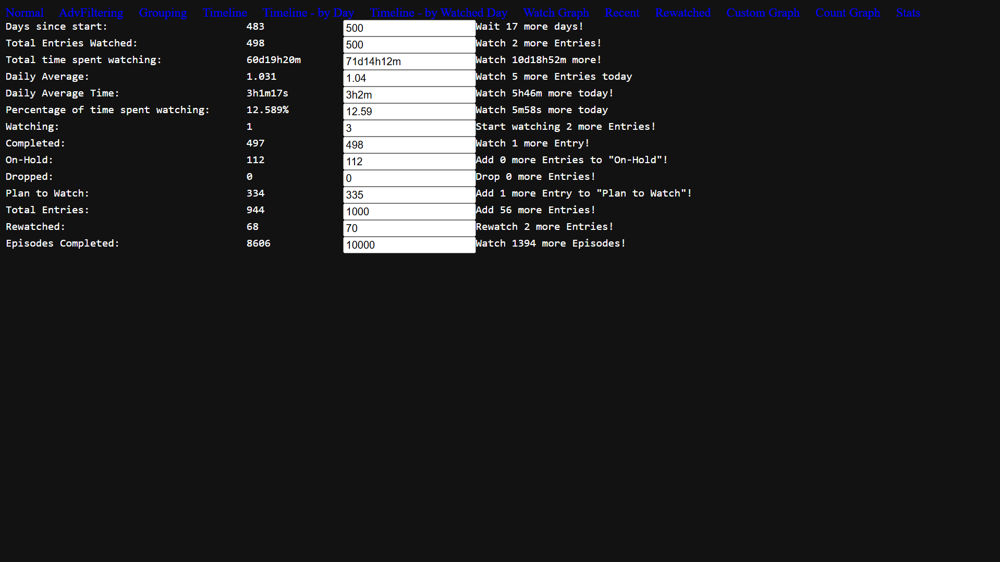

### How to use

&nbsp;&nbsp;&nbsp;&nbsp;&nbsp;&nbsp;&nbsp;&nbsp;As of right now, the text parser is configured to only read properly when your anime list is set to a specific setting. To make it match, you need to match these settings exactly: 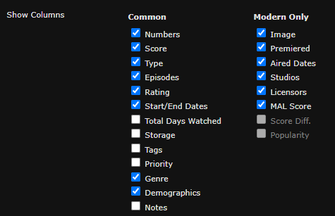 &nbsp;&nbsp;&nbsp;&nbsp;&nbsp;&nbsp;&nbsp;&nbsp;This can be found by navigating to your profile at "myanimelist.net/profile/\<username>", then "Profile Settings" in the top right, then to the "List" tab and scroll down. Setting your manga list to the same settings and loading it will work, but probably has some small issues. Make sure to hit "Submit" at the top or bottom of the settings page before closing it.
 
&nbsp;&nbsp;&nbsp;&nbsp;&nbsp;&nbsp;&nbsp;&nbsp;Next, open your anime list by going to "myanimelist.net/animelist\<username>". Make sure to load the entire page by scrolling to the bottom, or holding the "End" key until everything is loaded (the page only loads 300 entries to start). Use Ctrl+A to select all text on the page, Ctrl+C or right-click -> copy to copy all text to the clipboard, and then paste it all into a text file. You can input this file into the site by clickint "Change File" then "Choose file" then selecting your text file. Then press "Continue". If any of the buttons don't appear, reloading will likely solve it. Any time you submit a new file, the site will try to compare the old data with the new data, and report any differences.
## Notes
Since the project is made for my own use primarily, several things are assumed.
- The "On-Hold" section of the list is used for plan-to-watch entries that don't currently have an english dub.
- The "Dropped" section is unused, but should at the very least display entries as red in the main list
- All completed entries are scored, and have a watch start and watch end date recorded, although not having any of those shouldn't cause any significant error
- All minute lengths of entries are calculated assuming that you watch in 2x speed
- Several entries are hard coded to be grouped together in the "Groups" section, but not having these entries won't cause any error